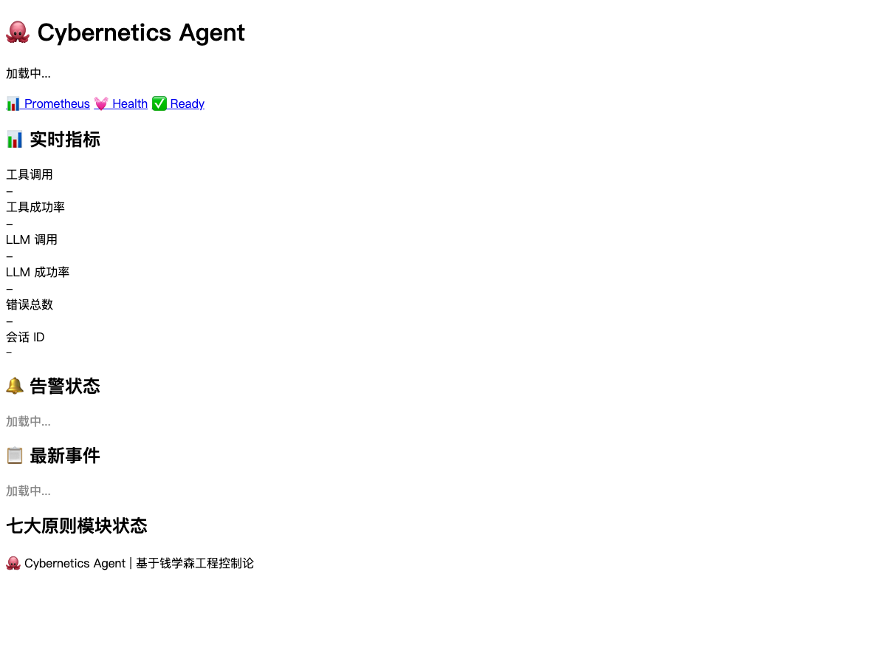

# 🦙 Cybernetics Agent

> 프레임워크 방지적 사이버네틱스 Agent 강화 계층입니다.
> 진학심《공학제어론》7대 핵심 원칙을 기반으로, 어떤 Python Agent든 자연적응, 자가복구, 자돕화 능력을 확보합니다.

[](https://www.python.org/downloads/)
[](https://opensource.org/licenses/MIT)
[]()

🌐 **[한국어](README.ko.md)** · [中文](README.md) · [English](README.en.md) · [Français](README.fr.md) · [Español](README.es.md) · [日本語](README.ja.md)

---

## ✅ 특징

- **프레임워크 방지적** — 순수 표준 라이브러리, 외부 의존성 없음
- **7대 원칙** — 진학심《공학제어론》 완전 커버
- **다중 프레임워크 어덜퍼** — LangChain, AutoGen, CrewAI, Hermes, Claude Code, Codex 등
- **선언적 구성** — JSON/YAML 구성, 유연하고 제어 가능
- **완전한 CLI** — `cybernetix` 명령줄 도구 (init / audit / dashboard / run)
- **스레드 안전** — 내장 스레드 잠금 보호

## 🚀 빠른 시작

```bash
# 설치
pip install cybernetics-agent

# 구성 초기화
cybernetix init

# 사용
python -c "
from cybernetics_agent import CyberneticsConfig, CyberneticsContext
ctx = CyberneticsContext(CyberneticsConfig(project_name='my-agent'))
ctx.emit_tool_result('search', ['paper1', 'paper2'])
print(ctx.get_status())
"
```

## 🎯 7대 원칙

| 원칙 | 모듈 | 기능 |
|------|--------|------|
| 1. 피드백 루프 | FeedbackLoop | 트리거 기반 동작, 자동 조정 |
| 2. 안정성 우선 | StabilityEngine | 재시도, 서킷 브레이커, 디그레이드, 타임아웃 |
| 3. 시스템 동일화 | SystemIdentifier | 변환 펄니, 효율 지표 수집 |
| 4. 최적 제어 | OptimalController | 예산 관리, 제약 조건 확인 |
| 5. 정보 이론 | InfoFlow | 메시지 필터링, 분배 |
| 6. 적응 제어 | AdaptiveTuner | 매개변수 자동 최적화 |
| 7. 계층적 제어 | HierarchyController | 전략/전술/실행 3계층 구조 |

## 🔧 지원 프레임워크

```python
from cybernetics_agent.adapters import (
    NativeAdapter,       # 순수 Python
    LangChainAdapter,    # LangChain
    AutoGenAdapter,      # AutoGen
    CrewAIAdapter,       # CrewAI
    HermesAdapter,       # Hermes Agent
    ClaudeCodeAdapter,   # Claude Code CLI
    CodexAdapter,        # OpenAI Codex CLI
    OpenClawAdapter,     # OpenClaw (HTTP)
    QwenpawAdapter,      # Qwenpaw
)
```

## 📁 CLI 도구

```bash
cybernetix init              # 구성 초기화
cybernetix audit ./src       # 코드 결함 감사
cybernetix dashboard         # 모니터링 대시보드 실행
cybernetix run ./task.py     # 작업 실행 및 지표 수집
```

## 📊 대시보드



대시보드 실행:
```bash
cybernetix dashboard
```

## 📝 라이센스

MIT License © 2026 Cybernetics Agent Contributors
